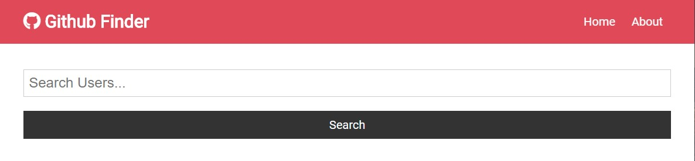
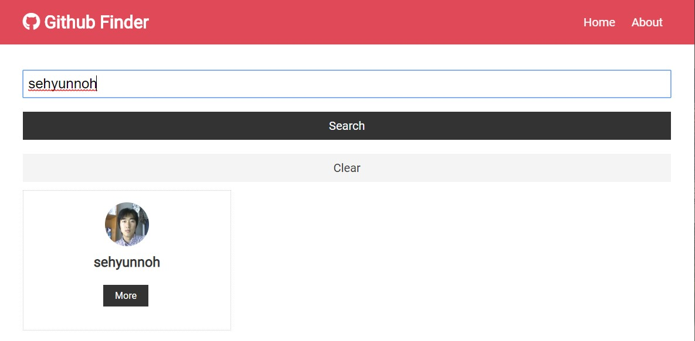
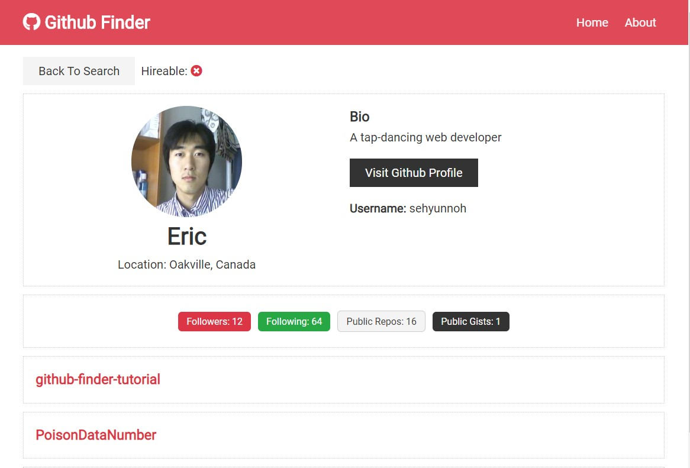

# [Github-Finder-Tutorial](https://sehyunnoh.github.io/github-finder-tutorial)
## 1. Main Page

> - Search function
> - Alert function when empty search

## 2. Search 

> - Clear function
> - More button

## 3. Detail 

> - Back to search
> - Visit Github Profile

## Technologies
> React, Hooks, Context, axios, react-router, ES6, NPM 